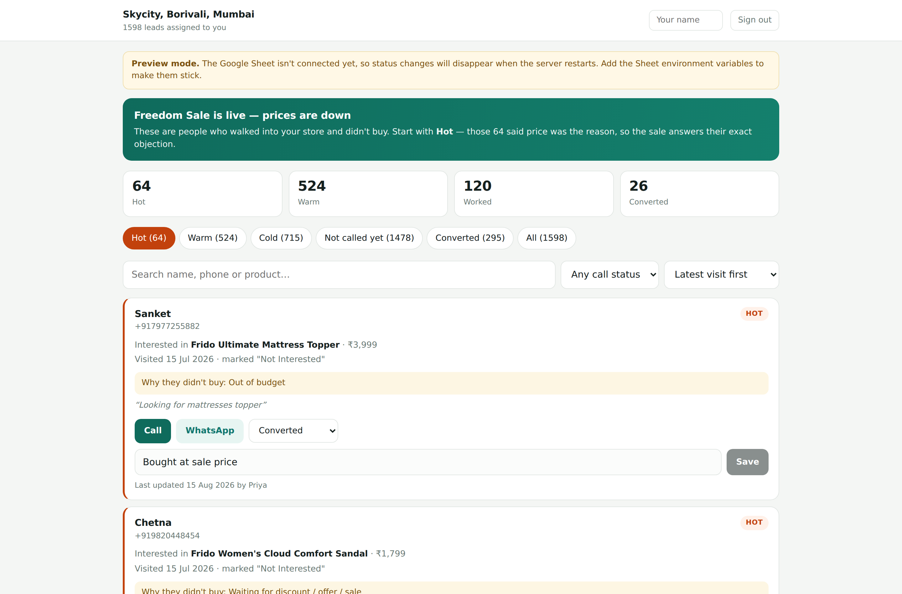
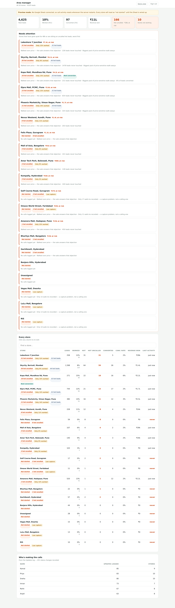

# Frido Store Leads

Per-store CRM for the Freedom Sale re-conversion push. Each of the 20 stores
enters a 4-digit code and sees only its own walk-in leads, sorted so the people
who walked away over price come first.

Setup and deployment: **[SETUP.md](./SETUP.md)**

## What a store person sees

Sign in with a 4-digit code, then a list of their leads with:

- **Hot / Warm / Cold tiers.** Hot means Zoho recorded the lost reason as
  "waiting for discount / offer / sale" or "out of budget" — the sale answers
  their exact objection, so they get called first.
- **One-tap Call and WhatsApp.** WhatsApp opens with a pre-written message that
  already names the customer and the product they were looking at.
- **Status and notes.** New / Interested / Callback Later / Not Reachable /
  Not Interested / Converted, plus a free-text note. Status saves the moment
  it's picked.
- **The original context** — what they came in for, the price, when they
  visited, what the store person wrote down at the time.
- **Sorting.** Newest visit first by default, because a walk-in from Tuesday
  converts better than one from March. Also oldest-first, highest or lowest
  lead value, and recently-worked.



## Sorting, precisely

`lib/sorting.js` is the whole of it, and both the server's first render and the
client's dropdown import the same file so they can't disagree. It has no
imports of its own — the board is a client component, and reaching into
`lib/data.js` for a comparator would drag googleapis and the 2MB snapshot into
the browser bundle.

Two details that matter on the real export:

- **1,552 of the 4,625 leads have no recorded price.** They sort to the bottom
  of *both* value directions. A missing price is unknown, not ₹0, and it must
  never head up a "lowest value first" list.
- **Ties break usefully.** Within one day, the expensive chair outranks the
  cushion; within one price, the fresher visit wins. Then `lead_id`, so the
  order is stable across reloads instead of drifting.

`node test_sorting.mjs` checks all of that against the real dataset.

## The admin view

`/admin`, behind `ADMIN_CODE` — a separate code from the store codes, and a
separate signed cookie. Every store in one table:



It leads with the numbers that prompt a phone call to a store manager:

- **Hot uncalled, and the rupees sitting in them.** Hot means they walked over
  price. The sale answers that objection, so an uncalled hot lead is the most
  expensive kind of inaction in the building.
- **Stores not working** — nothing logged at all, or nothing in 48 hours.
- **Low capture** — the five stores recording the fewest walk-ins. A different
  failure from not calling: these stores aren't writing leads down in the first
  place, and no amount of calling discipline fixes that.
- **Coverage, conversion rate and revenue won** per store, every column
  sortable.
- **Who's making the calls**, from the name staff type on the store dashboard.

The admin view is aggregate-only by design. It reports counts and totals and
never returns customer rows, so it can't become a side door to 4,600 phone
numbers.

## Layout

```
app/
  page.jsx              login
  dashboard/page.jsx    the board (server-rendered, store scoped)
  admin/page.jsx        area-manager view, gated on isAdmin()
  api/
    login/              code -> signed cookie
    leads/              this store's leads only
    lead-update/        append a status change
    admin-login/        ADMIN_CODE -> signed admin cookie
    admin-logout/
components/
  LoginForm.jsx
  LeadBoard.jsx         filters, search, tabs, sort
  LeadCard.jsx          one lead
  AdminLogin.jsx
  AdminBoard.jsx        cross-store table, flags, staff leaderboard
lib/
  session.js            signed httpOnly cookies, store and admin roles
  data.js               the one place store scoping is enforced
  sorting.js            lead ordering, shared by server and client
  sheets.js             Sheets client, caching, append-only writes
  ratelimit.js          login throttle
data/                   bundled snapshot, used when no Sheet is configured
screenshots/            generated from a running app, see below
```

## Where the store scoping lives

Only `getLeadsForStore(storeId)` in `lib/data.js` returns leads, and it filters
by `store_id` before anything else. `storeId` is read exclusively from the
signed cookie in `lib/session.js` — never from a request body or query string —
so a store can't reach another store's rows by editing a request. Writes
re-check that the lead belongs to the calling store before appending.

`getAdminOverview()` is the single exception — the one function that reads
across stores. It is unreachable without a valid admin cookie, and it returns
aggregates only.

The two roles are kept apart inside the signature, not just by cookie name. A
token's payload is `role:subject.expiry` and verification refuses any token
whose embedded role isn't the one being asked for. A store cookie is perfectly
valid and still cannot open `/admin`: re-signing it as `admin:` needs
`SESSION_SECRET`. `test_admin.py` replays a real store token into the admin
cookie slot to prove it.

## Tests

```bash
npm run dev                                    # SESSION_SECRET + ADMIN_CODE set

BASE_URL=http://127.0.0.1:3000 python3 test_app.py      # 18 checks
BASE_URL=http://127.0.0.1:3000 ADMIN_CODE=… python3 test_admin.py  # 18 checks
node test_sorting.mjs                                    # 18 assertions
```

- `test_app.py` — auth, store isolation, forged writes, the login throttle, and
  100 concurrent writes across all 20 stores.
- `test_admin.py` — the admin gate, role separation, and cookie replay. Restart
  the dev server between runs; the throttle check deliberately burns the
  window's allowance and the counter lives in server memory.
- `test_sorting.mjs` — ordering against the real 4,625-lead export, including
  the unpriced third.

Run the two Python suites against `npm run dev`, not a production server: the
session cookie is `Secure` in production and Python's cookiejar won't send it
over plain HTTP.

## Screenshots

`screenshots/` is generated by `scripts/screenshots.mjs`, not hand-taken. It
seeds a few hundred status updates first — otherwise every store reads "not
started" and the admin board has nothing to show — then captures the store and
admin views at phone and desktop widths.

Playwright is deliberately *not* a dependency of this app, so the Vercel build
stays small. Install it wherever you're running the script:

```bash
npm run dev                                    # in one terminal
npm install --no-save playwright               # or install it globally
BASE_URL=http://127.0.0.1:3000 ADMIN_CODE=… node scripts/screenshots.mjs
```

Set `CHROME_PATH` if Playwright can't find a browser. Restart the dev server
before re-running, or the seeding stacks on the previous run's numbers.
