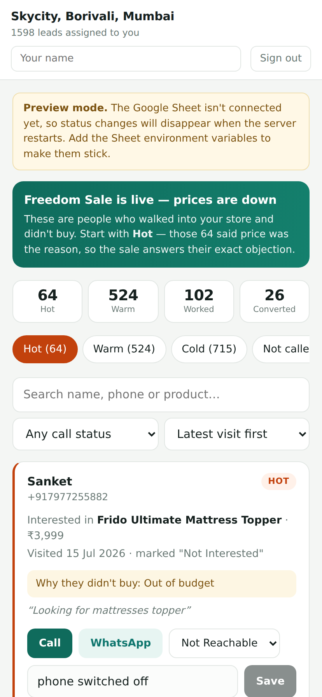
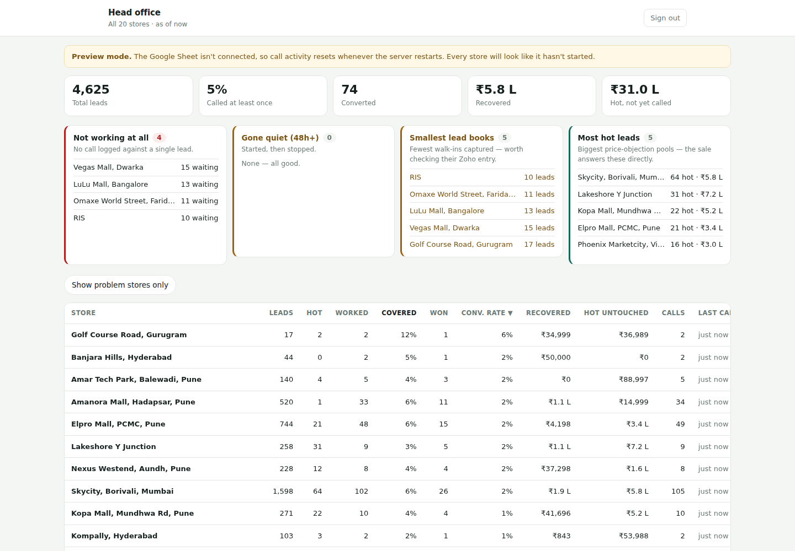

# Frido Store Leads

Per-store CRM for the Freedom Sale re-conversion push. Each of the 20 stores
enters a 4-digit code and sees only its own walk-in leads, sorted so the people
who walked away over price come first.

Setup and deployment: **[SETUP.md](./SETUP.md)**



## What a store person sees

Sign in with a 4-digit code, then a list of their leads with:

- **Newest walk-in first**, because someone who came in last week still
  remembers the visit. The order can be switched to oldest first, or to
  highest / lowest lead value so staff chase the ₹69,000 chair before the ₹999
  cushion, or to whatever the store worked most recently. The choice is
  remembered on that device.
- **Hot / Warm / Cold tiers.** Hot means Zoho recorded the lost reason as
  "waiting for discount / offer / sale" or "out of budget" — the sale answers
  their exact objection, so they get called first.
- **One-tap Call and WhatsApp.** WhatsApp opens with a pre-written message that
  already names the customer and the product they were looking at.
- **Status and notes.** New / Interested / Callback Later / Not Reachable /
  Not Interested / Converted, plus a free-text note. Status saves the moment
  it's picked.
- **The original context** — what they came in for, the price, when they
  visited, what the store person wrote down at the time.

## What head office sees

`/admin`, behind its own long code in `ADMIN_CODE`. Leave that variable unset
and the route stays switched off entirely.



It answers "who isn't working" four different ways, because they need different
follow-ups:

- **Not working at all** — no call logged against a single lead. A training or
  access problem.
- **Gone quiet (48h+)** — started, then stopped. A momentum problem.
- **Smallest lead books** — fewest walk-ins captured, which usually means leads
  aren't being entered into Zoho at the counter rather than that the store is
  quiet.
- **Most hot leads** — the biggest price-objection pools, with the rupee value
  still uncalled next to each.

Plus totals across the estate (leads, coverage, conversions, rupees recovered,
and the value of hot leads nobody has rung yet), a store table sortable by any
column, a staff leaderboard, and callouts for stores switched off in the
`Stores` tab or leads whose `store_id` matches no store at all.

## Layout

```
app/
  page.jsx              login
  dashboard/page.jsx    the board (server-rendered, store scoped)
  admin/page.jsx        head office, all stores (server-rendered)
  api/
    login/              code -> signed cookie
    leads/              this store's leads only
    lead-update/        append a status change
    admin/login/        admin code -> signed admin cookie
components/
  LoginForm.jsx
  LeadBoard.jsx         filters, search, tabs, sort
  LeadCard.jsx          one lead
  AdminLogin.jsx
  AdminBoard.jsx        cross-store table, flags, leaderboard
lib/
  session.js            signed httpOnly cookies, one per role
  data.js               the one place store scoping is enforced
  sorting.js            lead ordering, shared by server and client
  sheets.js             Sheets client, caching, append-only writes
  ratelimit.js          login throttle
data/                   bundled snapshot, used when no Sheet is configured
docs/screenshots/       what it looks like
```

## Where the store scoping lives

Only `getLeadsForStore(storeId)` in `lib/data.js` returns leads, and it filters
by `store_id` before anything else. `storeId` is read exclusively from the
signed cookie in `lib/session.js` — never from a request body or query string —
so a store can't reach another store's rows by editing a request. Writes
re-check that the lead belongs to the calling store before appending.

`getAdminOverview()` is the one accessor that deliberately crosses store
boundaries. It takes no store id and is only reachable from `/admin`, after
`isAdmin()` passes.

The role — `store` or `admin` — is part of the signed cookie payload, not just
the cookie's name. A valid store cookie pasted into the admin cookie slot fails
the signature check rather than being trusted, and vice versa. There's a test
for both directions.

## Tests

`test_app.py` runs against a dev server and covers auth, store isolation,
forged writes, the login throttle, 100 concurrent writes across all 20 stores,
and the admin dashboard's access control.

```bash
npm run dev
BASE_URL=http://127.0.0.1:3000 ADMIN_CODE=<your-admin-code> python3 test_app.py
```

Run it against `npm run dev`, not `npm start`: in production the session cookie
is marked `Secure`, and Python's cookie jar won't send those over plain HTTP, so
every logged-in check fails for the wrong reason. The admin checks are skipped
unless `ADMIN_CODE` is set. The throttling section deliberately burns the login
allowance for the window, so it runs last — restart the server before re-running.
